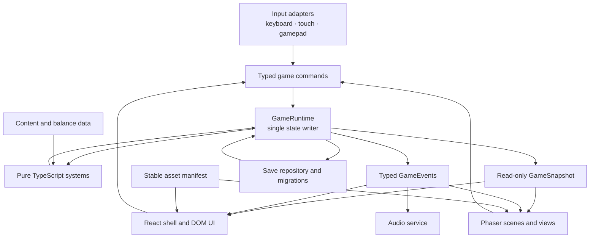

# Gym Buddies: Incremental Phaser 3 Migration Plan

**Status:** Proposed architecture and migration sequence only.
**Current source of truth:** Protected local v12 React prototype.
**Save identity:** `v12`.
**Migration rule:** Preserve a playable React path until each Phaser-rendered surface reaches parity.

## Executive decision

Gym Buddies should become a hybrid application with three clear layers:

1. **React** owns the application shell and text-, form-, menu-, and accessibility-heavy interfaces.
2. **Phaser 3** owns the animated 2D playfield: overworld, tilemaps, sprites, cameras, visual encounter staging, effects, and transitions.
3. **Pure TypeScript** owns the game: state transitions, progression, training, fatigue, encounters, capture calculations, balancing, content, and save serialization.

Phaser must not become a second game-state store. React and Phaser will observe the same read-only simulation snapshot and submit typed commands through one runtime boundary.

The migration must be incremental. The current React renderer stays available behind a development migration flag until the corresponding Phaser surface passes functional, input, save, accessibility, and performance checks. No phase may require rewriting all of `App.tsx` at once.

## Architectural goals

- Preserve all working v12 features and saved progress.
- Make game rules testable without mounting React or starting Phaser.
- Keep Phaser scenes thin, disposable, and presentation-focused.
- Keep trainer creation, settings, dialogue, party management, and accessible controls in the DOM.
- Use one explicit action map for keyboard, touchscreen, and gamepad compatibility.
- Keep balance and content in configuration modules.
- Add only Phaser as the required new runtime dependency.
- Preserve GitHub Pages base-path behavior for code and assets.
- Allow the React renderer to remain the fallback while Phaser is introduced.
- Remove old rendering code only after the replacement has passed a defined parity gate.

## 1. Current React-only implementation

### Baseline

- `client/src/App.tsx`: **5,420 lines**
- `client/src/index.css`: **1,598 lines**
- Save version: **v12**
- Current playfield rendering: React DOM elements and CSS
- Current Buddy and trainer rendering: character matrices mapped to DOM pixel elements
- Current audio: procedural Web Audio managed from `App.tsx`
- Current input: window-level WASD/arrow handling plus React touchscreen buttons

The current repository snapshot does not contain a tracked Gym Buddies package manifest or dedicated test configuration. A Gym-Buddies-only toolchain must be established or restored before adding Phaser. Unrelated workspace tooling must not be used as a substitute.

### What currently lives inside `App.tsx`

Line ranges are approximate anchors for the protected v12 file and will move once extraction begins.

| Current area | Approximate lines | Present responsibility | Intended destination |
|---|---:|---|---|
| Domain types | 3–234 | Creatures, Buddies, gyms, encounters, matches, machines, bosses, saves, trainer, audio, workout sessions | `game/core/` and feature-specific modules |
| Balance constants and boss/capture rules | 235–749 | Fatigue limits, workout timing, boss pressure, capture targets, modifiers, stat growth | `game/content/balance/` and `game/systems/` |
| Trainer focus configuration | 750–784 | Muscle mappings and trainer muscle metadata | `game/content/trainer.ts` |
| Save and timing constants | 785–789 | Save key/version, party size, boss timer bounds | `game/save/` and `game/content/balance/` |
| Machine definitions | 791–1096 | Six sets of four machines | `game/content/machines.ts` |
| Gym definitions | 1097–1154 | Home plus five gym areas | `game/content/gyms.ts` |
| Moves and Buddy species | 1157–1312 | Three capture moves and twelve species, including sprite matrices and palettes | Gameplay definitions in `game/content/`; visual records in `assets/` |
| Bosses, trainer presets, tutorial copy | 1277–1376 | Boss pools, names, customization presets, tutorial steps | `game/content/` and `ui/` copy modules |
| World topology | 1377–1594 | Grid dimensions, zone positions, route graph, walkable-map construction, route metadata | `game/content/routes.ts`, `game/systems/exploration/`, then Phaser tilemap adapter |
| General and workout calculations | 1595–1770 | Randomness, clamping, fatigue/readiness, load, stress, spot chance, Buddy workout profile | `game/core/` and `game/systems/workout/` |
| Music and sound engine | 1772–1939 | Procedural music notes, Web Audio lifecycle, sound cues | `game/audio/` |
| Progression and trainer calculations | 1940–2086 | Catch chance, boss interval, XP, Buddy seeding, color and muscle calculations | `game/systems/` and `game/core/` |
| React pixel renderers | 2087–2180 | `PixelCreature` and `TrainerSprite` DOM renderers | Retained React fallback, then Phaser entity/texture adapters |
| Encounter and boss factories | 2190–2240 | Wild selection, boss selection, difficulty and machine assignment | `game/systems/encounters/` and `game/systems/bosses/` |
| XP application | 2241–2268 | Level loop, HP growth, stat clamping | `game/systems/progression/` |
| Save initialization and loading | 2269–2369 | Defaults, localStorage read, v12 validation, normalization | `game/save/` |
| React state and derived state | 2370–2575 | Durable save, encounters, match, workout, route movement, UI panels, timers, emotes, drafts | Split according to the ownership table below |
| Browser and audio effects | 2576–2874 | Audio activation, music selection, route encounters, boss spawn, timers, recovery, keyboard, persistence | `game/audio/`, `game/input/`, `game/systems/`, `game/save/` |
| Setup and tutorial commands | 2875–3030 | Trainer editing, opening flow, reset, continue, tutorial routing | React screens issuing simulation commands |
| Exploration commands | 3031–3314 | Grid movement, route preview, travel, unlocking, encounter checks | `game/systems/exploration/`; Phaser renders results |
| Trainer creation renderer | 3315–3520 | Opening, customization, map preview, touch D-pad | `ui/screens/TrainerSetupScreen.tsx` |
| Workout flow | 3521–4047 | Workout resolution, timed spot phase, rewards, fatigue, steroid use, recovery | `game/systems/workout/` and `game/systems/recovery/` |
| Encounter start | 4048–4144 | Wild scouting and match initialization | `game/systems/encounters/` and `game/systems/capture/` |
| Capture resolution | 4145–4310 | Hold threshold, final chance, failure, team capacity, captured Buddy creation | `game/systems/capture/` and `game/systems/team/` |
| Match turn resolution | 4311–4491 | Move effects, pressure, fatigue, boss alignment, meter and round changes | `game/systems/capture/` |
| Main React renderer | 4492–5420 | Transitions, tutorial, audio UI, map, trainer, machines, party, workout, arena, index, log | Split between React UI and Phaser presentation |

### Current state-management characteristics

`App.tsx` currently holds 25 React state/ref values, including:

- Durable `SaveData`.
- Active encounter and arm-wrestling match.
- Active workout session and animation clock.
- World tile position, facing, movement lock, route encounter cooldown, and zone transition.
- Tutorial, trainer setup, draft trainer, panels, previews, messages, and activity log.
- Trainer emote timing and recovery cooldown.
- A mutable Web Audio engine reference.

It also uses browser time, random number generation, intervals, timeouts, microtasks, localStorage, and Web Audio directly. This works as a prototype, but it makes deterministic tests and independent Phaser rendering difficult.

### Current rendering surfaces

The current React UI contains:

- Trainer creation and opening controls.
- Tutorial and roadmap overlay.
- Header, settings, audio controls, and status broadcast.
- DOM/CSS world grid, route signs, location buttons, player marker, and touchscreen D-pad.
- Trainer customization.
- Machine selection, party slots, active Buddy, workout meter, and spot interaction.
- Capture arena, Buddy figures, boss state, pressure meter, move buttons, and narration.
- Buddy index and activity log.
- Zone-transition overlay.

The migration should not move all of these into Phaser. Only the animated playfield portions should cross the boundary.

## 2. Target architecture and dependency direction



### Non-negotiable rules

1. `game/core`, `game/content`, and `game/systems` import neither React nor Phaser.
2. `game/save` serializes simulation data, never Phaser scenes, sprites, tweens, cameras, DOM nodes, or audio nodes.
3. Phaser scenes receive snapshots and events through one bridge.
4. Phaser scenes submit commands; they do not mutate save data or simulation objects.
5. React receives the same snapshots and events; it does not read Phaser internals.
6. Only `GameRuntime` commits gameplay state changes.
7. Presentation events such as shake, sparkle, emote, and sound are not durable game state.
8. Any randomness or time used by rules comes through injected `RandomSource` and `GameClock` interfaces.
9. The Phaser frame loop animates presentation. It does not independently advance progression, encounters, captures, or fatigue.
10. React state updates occur for meaningful snapshots or UI changes, not on every Phaser frame.

### Integration contract

The bridge should expose three concepts:

- **Command:** player intent, such as move, select Buddy, choose machine, start workout, spot, rest, begin encounter, choose capture move, or continue.
- **Snapshot:** immutable data needed by React and Phaser to render the current game state.
- **Event:** a completed occurrence, such as movement accepted, zone entered, encounter started, move resolved, capture succeeded, workout failed, Buddy leveled, boss appeared, or save completed.

Commands are requests. Snapshots are current truth. Events explain what just happened and drive animation, sound, narration, and debug traces.

The bridge should use a small typed subscription implementation or browser `EventTarget`. Do not add a general-purpose state library solely to connect React and Phaser.

## 3. Proposed directory structure

```text
client/src/
  app/
    App.tsx
    AppShell.tsx
    bootstrap.tsx
    migrationFlags.ts
    providers/
      GameRuntimeProvider.tsx

  game/
    core/
      types.ts
      state.ts
      commands.ts
      events.ts
      gameRuntime.ts
      gameClock.ts
      randomSource.ts
      selectors.ts

    content/
      buddies.ts
      bosses.ts
      gyms.ts
      machines.ts
      moves.ts
      routes.ts
      trainer.ts
      tutorial.ts
      balance/
        captureBalance.ts
        progressionBalance.ts
        workoutBalance.ts

    systems/
      capture/
        captureRules.ts
        captureSystem.ts
      encounters/
        encounterFactory.ts
        encounterSystem.ts
      exploration/
        collisionRules.ts
        explorationSystem.ts
        routeGraph.ts
      fatigue/
        fatigueRules.ts
        fatigueSystem.ts
      progression/
        buddyGrowth.ts
        progressionSystem.ts
      recovery/
        recoverySystem.ts
      team/
        teamSystem.ts
      tutorial/
        tutorialSystem.ts
      workout/
        workoutRules.ts
        workoutSystem.ts
      bosses/
        bossRules.ts
        bossScheduler.ts

    phaser/
      createPhaserGame.ts
      phaserConfig.ts
      bridge/
        PhaserGameBridge.ts
        snapshotAdapter.ts
      scenes/
        BootScene.ts
        OverworldScene.ts
        EncounterScene.ts
        TransitionScene.ts
        DebugScene.ts
      entities/
        TrainerView.ts
        BuddyView.ts
        MachineView.ts
        EncounterView.ts
      animation/
        animationKeys.ts
        trainerAnimations.ts
        buddyAnimations.ts
        effectAnimations.ts
      camera/
        OverworldCamera.ts
        EncounterCamera.ts
      tilemaps/
        routeMapAdapter.ts
        tilemapKeys.ts
      effects/
        captureEffects.ts
        workoutEffects.ts
        transitionEffects.ts

    save/
      saveSchema.ts
      saveDefaults.ts
      saveMigrations.ts
      saveRepository.ts
      saveValidation.ts

    audio/
      audioEngine.ts
      audioEvents.ts
      music.ts
      soundEffects.ts

    input/
      actions.ts
      inputRouter.ts
      keyboardBindings.ts
      touchBindings.ts
      gamepadBindings.ts
      inputContext.ts

    debug/
      debugFlags.ts
      eventLog.ts
      performanceProbe.ts
      stateInspector.ts

  ui/
    screens/
      TrainerSetupScreen.tsx
      GameScreen.tsx
      SettingsScreen.tsx
      PartyScreen.tsx
    components/
      GameCanvas.tsx
      GameErrorBoundary.tsx
      PixelCreature.tsx
      TrainerSprite.tsx
      DialoguePanel.tsx
      TouchControls.tsx
    hud/
      WorldHud.tsx
      WorkoutHud.tsx
      CaptureHud.tsx
      FatigueHud.tsx
      SaveStatus.tsx
      StatusBroadcast.tsx
    panels/
      MachinePanel.tsx
      PartyPanel.tsx
      BuddyIndexPanel.tsx
      ActivityLogPanel.tsx

  assets/
    manifest.ts
    keys.ts
    data/
      buddyPixelSprites.ts
      trainerPixelSprites.ts
    characters/
    environment/
    tilemaps/
    fx/
    audio/

  tests/
    characterization/
    core/
    systems/
    save/
    input/
    phaser/
    integration/
    fixtures/
```

The exact filenames may be adjusted during extraction, but the dependency boundaries should not be weakened.

## 4. Proposed module responsibilities

| Module | Owns | Must not own |
|---|---|---|
| `app/` | Application composition, route/screen selection, providers, error boundaries, migration flags | Gameplay formulas, sprite mutation, save normalization |
| `game/core/` | Domain state, typed commands/events, clock/RNG contracts, runtime dispatch, selectors | React components, Phaser objects, browser persistence |
| `game/content/` | Original Gym Buddies data and balance configuration | Mutable play state, timers, DOM or Phaser APIs |
| `game/systems/` | Deterministic state transitions and gameplay rules | Rendering, audio playback, localStorage, physical input bindings |
| `game/phaser/` | Scenes, tilemap presentation, sprites, cameras, animations, particles, transitions | Progression authority, capture probability, save writes, UI forms |
| `game/save/` | v12 schema, defaults, validation, migration, local save repository | Scene state, React UI state, audio nodes |
| `game/audio/` | Procedural music/SFX lifecycle, cue playback, volume application | Deciding whether a capture or workout succeeds |
| `game/input/` | Physical-input-to-action mapping and active input context | Direct game-state mutation or scene-specific rules |
| `game/debug/` | Opt-in event tracing, state inspection, performance probes | Shipping cheats enabled by default |
| `ui/screens/` | Trainer setup, game shell, settings, party and dialogue flows | Simulation calculations or scene mutation |
| `ui/hud/` | Accessible controls and live status derived from snapshots | Authoritative copies of gameplay state |
| `ui/components/GameCanvas.tsx` | Create one Phaser instance, mount it into a stable element, update size, dispose on unmount | Recreating Phaser on every React render |
| `assets/` | Stable asset keys, manifests, source art/audio, temporary adapters for current pixel matrices | Balance numbers or mutable runtime state |
| `tests/` | Characterization, deterministic rules, save compatibility, bridge and scene smoke tests | Production runtime dependencies |

### React responsibilities after migration

React remains responsible for:

- New Game, Continue, trainer creation, and trainer customization.
- Settings, audio controls, reduced motion, text scaling, and input help.
- Tutorial and dialogue panels.
- Party selection and management.
- Machine information and workout controls.
- Capture move buttons, readable pressure status, narration, and results.
- Buddy index, activity log, save status, and accessible status announcements.
- Touchscreen control overlays.
- Error recovery and fallback to the verified React renderer during migration.

### Phaser responsibilities after migration

Phaser becomes responsible for:

- Rendering the overworld and gym interiors.
- Tilemap layers, collision visualization, route landmarks, and environmental animation.
- Trainer and Buddy sprite instances.
- Camera follow, room framing, bounds, zoom, and restrained shake.
- Movement tweening and walk/idle animation.
- Encounter visual staging and Buddy poses.
- Workout, arm-wrestling, capture, boss, and level-up visual effects.
- Zone, encounter, and result transitions.
- Presentation-only debug overlays such as collision and camera bounds.

Phaser does not own the capture buttons, dialogue text, settings menus, party screens, save data, or gameplay calculations.

### Pure TypeScript responsibilities after migration

Pure modules own:

- Trainer, Buddy, team, gym, machine, route, encounter, match, workout, and boss state.
- Movement validity, route connectivity, encounter checks, and travel fatigue.
- Workout readiness, timing windows, success, failure, rewards, and growth.
- Fatigue accumulation and recovery.
- Boss scheduling and challenge-machine alignment.
- Arm-wrestling rounds, meter change, thresholds, probability, capture, and failure.
- XP, levels, HP, Buddy growth, collection tracking, and unlocks.
- Save defaults, schema validation, migration, and serialization.
- Content and all balance values.

## 5. State ownership

### Ownership matrix

| State | Source of truth | Saved? | React use | Phaser use |
|---|---|---:|---|---|
| Trainer identity, colors, muscles | Simulation | Yes | Forms and summaries | Selects trainer visual key/palette |
| Buddy team, active index, stats, HP, XP | Simulation | Yes | Party, HUD, management | Chooses entities and poses |
| Seen/caught species | Simulation | Yes | Buddy index | Capture presentation only |
| Active zone and unlocked zones | Simulation | Yes | Location text and menus | Loads/frames current map |
| Logical world tile position | Simulation | At safe checkpoints; policy to validate | Accessible location feedback | Converts tile position to world position |
| Movement eligibility and cooldown | Simulation | Usually no | Enables touch controls | Chooses animation start/stop |
| Sprite pixel position and tween progress | Phaser | No | None | Yes |
| Facing and animation frame | Phaser presentation derived from the last accepted movement event | No | May show direction text if needed | Yes |
| Camera position, zoom, bounds, shake | Phaser | No | None | Yes |
| Selected machine | Simulation | Yes | Machine panel | Highlights world object |
| Workout session and spot window | Simulation runtime | Resume policy to validate | Controls and accessible timing | Workout animation/effects |
| Fatigue, momentum, deload tokens | Simulation | Yes | HUD and explanations | Presentation cues |
| Encounter and arm-wrestling match | Simulation runtime | Resume policy to validate | Move controls, meter, narration | Encounter poses and effects |
| Boss schedules and defeated count | Simulation | Yes | Boss status | Arrival presentation |
| Zone transition intent/result | Simulation event | No | Accessible announcement | Transition animation |
| Trainer emote | Presentation event | No | React fallback only | Animation selection |
| Message and activity log | Event history managed outside Phaser | Optional | Accessible broadcast/log | No authority |
| Setup draft, open panels, focused control | React | No | Yes | No |
| Tutorial/dialogue visibility | React; completed milestone in simulation | Completion only | Yes | Scene pause/context signal |
| Audio enabled and volumes | Simulation/save settings | Yes | Settings controls | No direct ownership |
| Audio nodes, music step, active cue | Audio service | No | No | No |
| Pressed keys, touch pointers, connected pads | Input service | No | Consumes actions in UI context | Consumes actions in world context |
| Debug overlays and performance samples | Debug services | No | Optional panel | Optional scene overlay |

### How current React state should move

| Current `App.tsx` value | Destination |
|---|---|
| `save` | `GameRuntime` durable simulation state |
| `encounter`, `match` | Simulation encounter/capture system |
| `workoutSession` | Simulation workout system |
| `workoutFrame`, `tick` | Injected game clock and presentation selectors |
| `message`, `log` | Typed events consumed by accessible React status/history |
| `zoneTransit` | Simulation transition event plus Phaser animation state |
| `worldPlayerPos` | Logical tile position in simulation |
| `worldMoveLockUntil`, `lastRouteEncounterMs` | Exploration system runtime state |
| `trainerFacing`, `trainerEmote`, `trainerEmoteUntil` | Phaser presentation derived from events; React fallback retains them until cutover |
| `nextRestAvailableMs` | Recovery system runtime state |
| `showRoadmap`, `previewZoneId`, `showTrainerPanel`, `showStarterSetup` | React UI state |
| `draftTrainer` | React form draft; committed through a simulation command |
| `pendingTutorialRoute` | Tutorial/application flow state, with completion milestone in simulation |
| `audioRef` | `game/audio/audioEngine.ts` service lifecycle |

## 6. Phaser scene strategy

Use a small scene set:

- **BootScene:** loads the manifest, creates animations, and reports progress/errors to React.
- **OverworldScene:** renders the active map, trainer, machines, route markers, and environmental animation.
- **EncounterScene:** renders the two Buddies, arm-wrestling presentation, boss staging, and battle effects.
- **TransitionScene:** coordinates short presentation transitions only if a separate scene proves simpler than camera/overlay helpers.
- **DebugScene:** development-only camera, collision, FPS, and event visualization.

Do not create Phaser menu, trainer-creation, settings, party, dialogue, or index scenes. Those remain React screens.

### Scene lifecycle

- `GameCanvas` creates one `Phaser.Game` after its container mounts.
- React Strict Mode remounts must not leave duplicate canvases, listeners, timers, or audio.
- Scenes subscribe to the bridge on `create` and unsubscribe on shutdown/destroy.
- A scene reads an initial snapshot, then responds to snapshot changes and typed events.
- A scene emits commands through the bridge.
- Scene transitions never carry mutable simulation objects in Phaser scene data.
- Phaser is paused when a blocking React modal requires exclusive input.
- Resize uses a stable container and a `ResizeObserver`; it must not recreate the game.

### Overworld model

The initial Phaser overworld should adapt the existing discrete grid and route graph rather than redesign movement:

1. Convert the current walkable tile set and zone positions into a tilemap adapter.
2. Render existing logical coordinates with simple placeholder-equivalent original tiles.
3. Mirror accepted simulation movement with a sprite tween.
4. Add camera follow and bounds.
5. Introduce authored tilemap JSON only after movement, collision, routes, fatigue, and encounters match v12.

This avoids combining a map redesign with the engine migration.

### Encounter model

The first Phaser encounter scene should be presentation-only:

- React continues to render accessible move controls, meter/status, narration, and results.
- Pure capture systems resolve commands and publish snapshots/events.
- Phaser displays the Buddies, move animation, pressure reaction, near-capture effects, boss emphasis, capture success, and escape.
- Effects end when their animation completes, but game outcomes never depend on tween completion.

### Current pixel art transition

The existing sprite matrices and palettes should be preserved through the first Phaser parity pass:

- Use stable visual keys for each trainer/Buddy presentation.
- Generate Phaser textures from the current matrix data or pre-render equivalent original assets.
- Keep gameplay species definitions keyed to a visual asset rather than importing Phaser.
- Move matrix/palette data into `assets/data/` once the content module has stable IDs.
- Replace temporary generated textures only in a later art-production phase.

## 7. Incremental extraction and migration order

Every phase must end with typecheck, tests, linting, production build, and a GitHub Pages path smoke test when assets or build configuration change.

### Phase 0 — Characterize and protect v12

- Confirm the snapshot branch/tag and current foundation branch.
- Restore or create a tracked Gym-Buddies-only package and test configuration.
- Record current build output, load flow, controls, save key, and representative screenshots.
- Add v12 save fixtures.
- Add characterization tests around progression, workout, fatigue, route movement, encounters, boss spawning, and capture.
- Record an end-to-end smoke path through Home Gym, Warm Up Path, and Starter Gym A.
- Correct any disallowed franchise-comparison UI copy as an isolated originality task, not as part of Phaser behavior changes.

**Gate:** the current React game remains playable, v12 saves load, and behavior is reproducible.

### Phase 1 — Extract shared types and content

- Move domain types into `game/core/types.ts`.
- Move machines, gyms, routes, moves, bosses, species, trainer presets, and balance tables into `game/content/`.
- Preserve object values, IDs, array order, and random pool membership.
- Re-export temporarily where needed to keep `App.tsx` changes mechanical.

**Gate:** React output and gameplay behavior are unchanged; no Phaser dependency exists yet.

### Phase 2 — Extract deterministic calculations

- Move pure workout, fatigue, progression, boss, and capture calculations into feature modules.
- Introduce injectable `GameClock` and `RandomSource`.
- Keep compatibility wrappers in `App.tsx` while callers are migrated one function at a time.
- Add seeded tests before changing formulas.

**Gate:** identical inputs and random seeds produce equivalent v12 outcomes.

### Phase 3 — Extract saves

- Move v12 defaults, validation, normalization, serialization, and localStorage access into `game/save/`.
- Keep the serialized v12 shape unchanged.
- Separate browser storage from pure schema validation.
- Add malformed, missing-field, full-team, and round-trip fixtures.

**Gate:** current v12 saves load and resave without semantic data loss.

### Phase 4 — Split the React UI without changing presentation

- Move trainer setup, HUDs, machine panel, party panel, capture panel, index, log, and status broadcast into React components.
- Retain current DOM world and encounter presentation.
- Pass view models and command callbacks rather than exposing setters broadly.
- Preserve CSS classes initially to minimize visual regressions.

**Gate:** the working React UI is visually and behaviorally equivalent, while `App.tsx` becomes composition rather than implementation.

### Phase 5 — Introduce `GameRuntime`

- Define typed commands, events, snapshots, and selectors.
- Move one system at a time behind `dispatch`, beginning with trainer/team selection and recovery.
- Continue through workouts, exploration, encounters, capture, and bosses.
- Prohibit direct save mutation from React after each feature crosses the boundary.
- Keep the React renderer as the only renderer.

**Gate:** React runs entirely from runtime snapshots and commands; the runtime can execute core flows without React.

### Phase 6 — Unify input

- Define actions for movement, confirm, cancel, pause, interact, workout, spot, rest, and capture moves.
- Move keyboard bindings out of `App.tsx`.
- Route touchscreen controls through the same actions.
- Preserve gamepad compatibility through a gamepad adapter and action map.
- Add input contexts so typing in forms and navigating modals cannot move the trainer.

**Gate:** keyboard, touchscreen, and gamepad smoke tests reach the same simulation commands.

### Phase 7 — Extract audio

- Move the current procedural Web Audio engine and cue mapping into `game/audio/`.
- Drive sounds from typed events.
- Keep saved volume/mute settings in simulation/save state.
- Ensure one audio service is created and disposed independently from React and Phaser render lifecycles.

**Gate:** audio behavior is equivalent and no scene owns a second music engine.

### Phase 8 — Add Phaser in shadow mode

- Add only the `phaser` runtime dependency.
- Add `GameCanvas`, Phaser configuration, bridge, BootScene, and an empty OverworldScene.
- Mount the canvas beside or beneath the existing React playfield under a development-only `phaser-shadow` flag.
- Feed read-only snapshots to Phaser.
- Do not allow Phaser to issue gameplay commands yet.

**Gate:** Phaser starts, resizes, pauses, resumes, and disposes without changing gameplay or creating duplicate instances.

### Phase 9 — Render the vertical-slice overworld in Phaser

- Render Home Gym, Warm Up Path, and Starter Gym A first.
- Adapt the current grid, collision, zone coordinates, and route labels.
- Render the trainer at the simulation position.
- Add camera follow and simple movement animation.
- Keep the React world renderer visible as the default and use Phaser shadow mode for comparison.

**Gate:** every accepted movement, collision, transition, fatigue change, and encounter trigger matches React behavior.

### Phase 10 — Switch overworld presentation incrementally

- Enable Phaser overworld presentation for the vertical-slice locations behind a reversible migration flag.
- Let Phaser movement input dispatch shared actions.
- Keep React HUD, touch controls, route text, machine UI, and accessibility announcements.
- Retain React rendering for locations not yet ported.
- Expand the tilemap and visual parity check across the remaining gyms and routes.

**Gate:** all v12 locations are reachable with equivalent behavior before the legacy DOM overworld is retired.

### Phase 11 — Add Phaser encounter presentation

- Add EncounterScene and Buddy views.
- Mirror encounter/match snapshots.
- Animate move events, boss pressure, near capture, success, failure, and escape.
- Keep capture choices, meter semantics, narration, and result controls in React.
- Validate that skipping or reducing animation cannot alter the result.

**Gate:** wild and boss captures produce identical simulation outcomes with React-only and Phaser presentation modes.

### Phase 12 — Add transitions and presentation effects

- Move zone, encounter, capture, boss-arrival, workout-result, and level-up visual transitions to Phaser where they affect the playfield.
- Keep accessible announcements in React.
- Respect reduced motion and page visibility.
- Keep effects restrained enough to preserve meter and sprite readability.

**Gate:** effects add no input lock, stale overlay, scene leak, or save timing dependency.

### Phase 13 — Retire replaced DOM playfield code

- Remove the DOM world grid only after all locations pass the overworld gate.
- Remove duplicated encounter figures/effects only after EncounterScene passes its gate.
- Keep React controls, HUD, narration, settings, party, and accessibility surfaces.
- Remove obsolete CSS in small batches with visual regression checks.
- Remove migration flags only after the Phaser path has been the tested default for a full release candidate.

**Gate:** there is one presentation owner for each migrated surface and no duplicate gameplay state.

### Phase 14 — Hardening

- Test v12 saves, refresh, background/resume, resize, rotation, reduced motion, audio blocking, and corrupted save fallback.
- Profile load time, bundle size, frame pacing, memory, React render frequency, and scene transitions.
- Confirm stable asset keys and GitHub Pages paths.
- Run the complete 15–20 minute vertical-slice playtest on desktop and mobile.
- Re-run the broader v12 regression route across all gyms and bosses.

**Gate:** Phaser is the default playfield renderer and the existing React product UI remains intact.

## 8. UI preservation strategy

### Migration modes

Use temporary development flags:

- `react`: current renderer only; default until the first Phaser parity gate passes.
- `phaser-shadow`: Phaser mirrors snapshots without owning visible production presentation or gameplay commands.
- `phaser`: Phaser owns only the surfaces explicitly marked as migrated.

Flags should be compile-time or developer settings, not new long-lived save fields.

### Preservation rules

- Do not change save schema and renderer in the same phase.
- Do not rebalance gameplay during a mechanical extraction.
- Do not replace trainer creation, settings, dialogue, party, or accessible controls with canvas UI.
- Keep existing React components and CSS classes until the corresponding parity tests exist.
- Do not remove a React fallback in the same commit that first introduces its Phaser replacement.
- Do not let both React and Phaser submit the same movement input simultaneously.
- When a React modal is active, the input router must suspend world commands.
- Keep visible and assistive status updates in React even after the visual effect moves to Phaser.

## 9. Dependency policy

### Required addition

- `phaser`

Add it only in Phase 8, after the pure runtime and tracked Gym Buddies toolchain exist.

### Do not add by default

- A React-to-Phaser wrapper.
- Redux, Zustand, MobX, or another global store solely for the bridge.
- An entity-component-system library.
- A second event-bus package.
- A physics plugin; Phaser's built-in capabilities are sufficient unless a measured need emerges.
- A runtime tilemap parser beyond Phaser's supported formats.
- A separate audio library while the existing Web Audio system remains suitable.
- A general animation library for the Phaser canvas.

An external map editor may later be used as an authoring tool, but it does not need to become a shipped runtime dependency.

### Asset and GitHub Pages policy

- Reference assets through stable manifest keys.
- Let Vite resolve imported asset URLs or prefix public assets with the configured base.
- Do not hard-code root-relative `/assets/...` paths.
- Test the production build under the repository subpath after every asset/configuration phase.
- Keep source art, generated runtime assets, and build output clearly separated.
- Do not commit generated production folders.

## 10. Testing and validation plan

### Characterization before extraction

- Save fixture loads to the same trainer, team, zones, machines, fatigue, collection, bosses, tutorial, and audio settings.
- Seeded workouts produce the same session and outcome.
- Seeded wild and boss encounters select the same content and level.
- Seeded capture turns produce the same meter, fatigue, failure, and capture result.
- Route movement produces the same collision, unlock, fatigue, and encounter checks.

### Pure module tests

- Command validation and state transitions.
- Exploration collision and route graph.
- Workout success, spot timing, rewards, and failure.
- Fatigue boundaries and recovery.
- XP, level, HP, form, mobility, and volume growth.
- Boss schedule and challenge alignment.
- Capture moves, thresholds, probabilities, team capacity, and failure states.
- Save validation, migration, and round-trip serialization.
- Deterministic RNG and clock behavior.

### Bridge tests

- React and Phaser receive the same snapshot version.
- One command creates at most one state transition.
- Events are ordered and unsubscribed consumers stop receiving them.
- A remounted Phaser host does not duplicate listeners or commands.
- Blocking React UI changes input context without changing simulation state.

### Phaser tests

- Boot and asset error handling.
- Scene create, sleep, wake, shutdown, and destroy.
- Snapshot-to-entity mapping.
- Tile coordinate-to-world coordinate conversion.
- Camera bounds and resize behavior.
- Animation and effect completion without state mutation.
- Reduced-motion path.
- No duplicate canvas under React Strict Mode.

### End-to-end parity tests

Run the same scripted journey in React and Phaser presentation modes:

1. Load a v12 save.
2. Create or edit a trainer.
3. Move from Home Gym across Warm Up Path.
4. Select and use machines.
5. Accumulate and recover fatigue.
6. Trigger a wild encounter.
7. Complete a workout spot event.
8. Resolve a wild capture.
9. Trigger and resolve a boss match.
10. Save, reload, and continue.

Compare authoritative simulation snapshots at meaningful checkpoints, not DOM structure or sprite coordinates.

### Performance checks

- One Phaser instance and one active audio service.
- No React render on every Phaser frame.
- No simulation mutation on every frame unless a future real-time rule explicitly requires it.
- Stable 60 FPS target and at least 30 FPS on the agreed minimum mobile device.
- No steady memory growth across three zone/encounter cycles.
- Canvas and DOM overlay remain aligned after resize and orientation change.
- Input feedback begins within 100 ms.
- Phaser and asset additions remain within the vertical-slice bundle budget or receive an explicit reviewed exception.

## 11. Decisions that still need validation

1. **Tracked toolchain:** establish the canonical Gym Buddies package, lockfile, typecheck, lint, test, and build commands before adding Phaser.
2. **Map authoring:** use the current generated grid for first parity; decide later whether authored Phaser/Tiled JSON improves production workflow.
3. **Logical position persistence:** determine whether to save the exact safe tile or continue saving only the active zone.
4. **Interrupted sessions:** decide whether workouts and arm-wrestling matches resume after reload or safely restart.
5. **Simulation timing:** retain event-driven commands and timestamp checks for current gameplay; add a fixed simulation step only if future real-time mechanics require it.
6. **TransitionScene:** keep it separate only if it reduces complexity; otherwise use view/effect helpers in the active scene.
7. **Pixel source format:** choose generated Phaser textures from current matrices versus pre-rendered image assets after visual parity is proven.
8. **Audio backend:** preserve the current Web Audio implementation initially; evaluate Phaser audio only if it solves a measured lifecycle or asset need.
9. **Snapshot granularity:** measure whether whole immutable snapshots are sufficient before introducing feature-specific subscriptions.
10. **Minimum device/browser:** lock the mobile performance test device and supported browser versions before Phaser becomes default.

## 12. Migration completion criteria

The migration is complete when:

- React owns the shell, setup, settings, dialogue, party, accessible controls, HUD, and narration.
- Phaser owns the overworld, tilemaps, sprites, cameras, animation, visual encounter stage, effects, and transitions.
- Pure TypeScript owns all gameplay rules and durable state.
- React and Phaser communicate only through typed commands, snapshots, and events.
- The v12 save format loads without semantic loss or has an explicit tested migration.
- All six current gyms, routes, machines, species, bosses, workouts, fatigue, recovery, captures, audio, and progression remain functional.
- Keyboard, touchscreen, and gamepad compatibility do not regress.
- GitHub Pages production paths work.
- The React fallback has been removed only from surfaces with verified Phaser parity.
- Typecheck, tests, linting, production build, device checks, and the complete v12 regression journey pass.

## Recommended first implementation task

Begin with **Phase 0 only**: establish the tracked Gym-Buddies-only toolchain and write characterization tests against the protected v12 behavior. Do not install Phaser or change rendering until that safety net passes.
